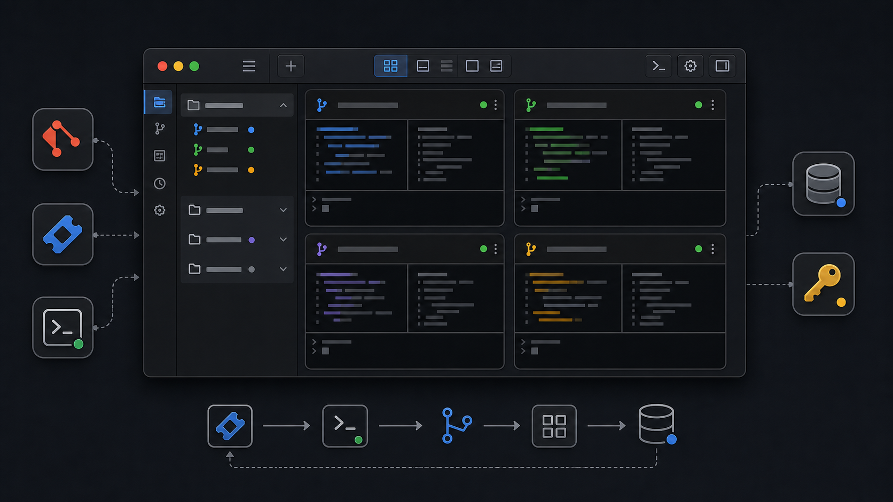

# Sexy Worktree

<div align="center">
  
</div>

<br />

<div align="center">
  <strong>A macOS desktop app for managing multiple Git worktrees in one window.</strong>
  <br />
  <span>Open a repository, see every worktree as a terminal card, create new branches, and keep each task context visible.</span>
  <br />
  <br />
  
</div>

## Overview

Sexy Worktree is a local developer workspace for teams and individuals who use Git worktrees heavily. Instead of juggling separate terminal windows, tabs, and directories, the app turns each worktree into a compact card with interactive terminals inside it.

The goal is simple: keep parallel branch work visible, organized, and fast to resume.

## Highlights

| Feature              | Description                                                                                                     |
| -------------------- | --------------------------------------------------------------------------------------------------------------- |
| Worktree dashboard   | View all worktrees for the active repository in a dense terminal-card grid.                                     |
| Focus mode           | Zoom into a single worktree when you need more room.                                                            |
| Embedded terminals   | Each worktree card owns interactive `xterm.js` terminals backed by `node-pty`.                                  |
| Split panes          | Split terminal panes horizontally or vertically inside a worktree card.                                         |
| New worktree flow    | Create a new worktree from a branch name or from a Jira ticket.                                                 |
| Jira-assisted naming | Resolve a Jira ticket and generate a clean branch name with Claude Code CLI support.                            |
| Repository settings  | Configure base directory, default base branch, copied files, install command, and init commands per repository. |
| Safe secrets         | Store Jira tokens outside repository config using Electron `safeStorage`.                                       |
| Worktree cleanup     | Select non-main worktrees and remove them through a guarded force-delete flow.                                  |
| macOS packaging      | Build an Apple Silicon DMG with `electron-builder`.                                                             |

## What It Feels Like

- One app window for the main repository.
- A left rail for switching between worktrees.
- A toolbar for creating, focusing, selecting, and configuring worktrees.
- A grid of terminal cards, each tied to a real worktree path.
- Dark, compact, terminal-first UI based on the project design system.

## Tech Stack

| Area        | Stack                                                      |
| ----------- | ---------------------------------------------------------- |
| Desktop     | Electron, electron-vite                                    |
| UI          | React, TypeScript, Tailwind CSS v4, Radix UI, lucide-react |
| Terminal    | xterm.js, node-pty, Allotment                              |
| Persistence | better-sqlite3, Electron safeStorage                       |
| Validation  | zod                                                        |
| Automation  | Claude Code CLI package, Atlassian REST API                |
| Tests       | Vitest, jsdom for renderer DOM tests                       |
| Packaging   | electron-builder                                           |

## Getting Started

Install dependencies:

```bash
pnpm install
```

Run the app in development mode:

```bash
pnpm dev
```

Build the app:

```bash
pnpm build
```

Preview the built app:

```bash
pnpm start
```

## Repository Configuration

Sexy Worktree can use a repository-local config file at `.sexyworktree/config.json`. If the file does not exist, the app falls back to defaults.

Example:

```json
{
  "version": 1,
  "worktree": {
    "baseDir": "../worktrees",
    "defaultBaseBranch": "main",
    "filesToCopy": [".env.local"],
    "installCommand": "pnpm install",
    "initCommands": ["pnpm typecheck"]
  },
  "jira": {
    "enabled": true,
    "workspaceUrl": "https://example.atlassian.net",
    "email": "dev@example.com",
    "tokenKeychainKey": "jira.example"
  },
  "branchValidation": {
    "requireJiraPattern": true
  }
}
```

Do not put Jira API tokens in this file. Store them through the app settings screen; the app saves them with the configured `tokenKeychainKey`.

## Commands

| Command                     | Purpose                                                        |
| --------------------------- | -------------------------------------------------------------- |
| `pnpm dev`                  | Start the Electron development app.                            |
| `pnpm build`                | Build main, preload, and renderer bundles.                     |
| `pnpm start`                | Preview the built app.                                         |
| `pnpm typecheck`            | Run TypeScript project checks.                                 |
| `pnpm lint`                 | Run ESLint over `src`.                                         |
| `pnpm format:check`         | Check formatting with Prettier.                                |
| `pnpm test`                 | Rebuild native modules, run Vitest, then rebuild for Electron. |
| `pnpm vitest run <pattern>` | Run a focused test target.                                     |
| `pnpm dist:mac`             | Build an arm64 macOS DMG.                                      |
| `pnpm dist:mac:dir`         | Build an unpacked macOS app directory.                         |

## Keyboard Shortcuts

| Shortcut               | Action                     |
| ---------------------- | -------------------------- |
| `Cmd + O`              | Open repository            |
| `Cmd + N`              | Create new worktree        |
| `Cmd + ,`              | Open settings              |
| `Cmd + .`              | Toggle overview/focus mode |
| `Cmd + W`              | Close active pane          |
| `Cmd + D`              | Split pane vertically      |
| `Cmd + Shift + D`      | Split pane horizontally    |
| `Cmd + Shift + ]`      | Next worktree              |
| `Cmd + Shift + [`      | Previous worktree          |
| `Cmd + Option + Arrow` | Move pane focus            |

## Project Layout

```text
sexy-worktree/
|-- src/main/      # Electron main process: Git, worktrees, PTY, config, persistence
|-- src/preload/   # typed bridge exposed to the renderer
|-- src/renderer/  # React UI and application state
|-- src/shared/    # shared contracts and pure utilities
|-- test/          # Vitest test suite
|-- docs/          # release notes and README assets
`-- DESIGN.md      # UI design-system source of truth
```

## Design Direction

The app is dark-only for the MVP and uses a compact Darcula-inspired interface. Terminal cards are the primary surface; decoration stays minimal so the workspace remains scannable.

Read `DESIGN.md` before changing UI code.

## Release

Build a local macOS DMG:

```bash
pnpm dist:mac
```

The current packaging target is an ad-hoc-signed Apple Silicon DMG. See `docs/release.md` for release and first-launch notes.

## Notes

- Open the main repository path, not one of its worktree paths.
- Worktree deletion is intentionally forceful and meant for deliberate cleanup.
- Renderer code does not call Node APIs directly; filesystem, Git, terminal, and secret operations stay behind the Electron bridge.
- Generated output under `out/` is not source code.
